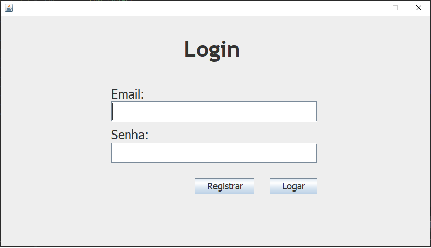
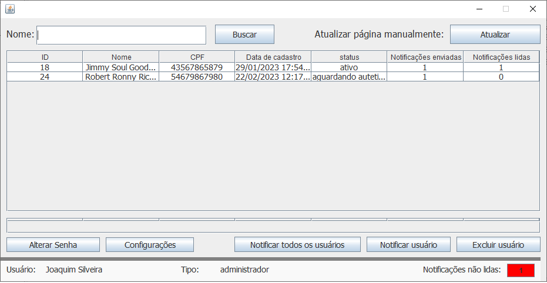
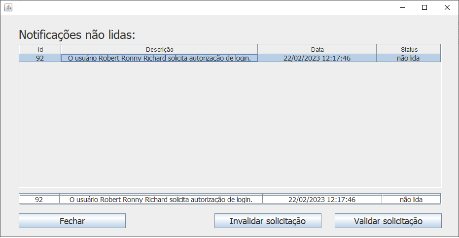
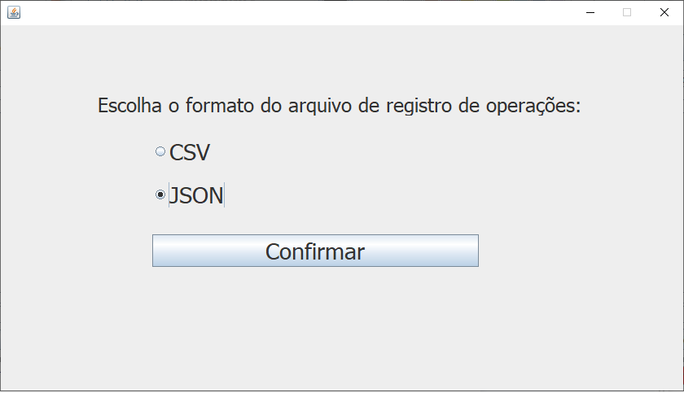
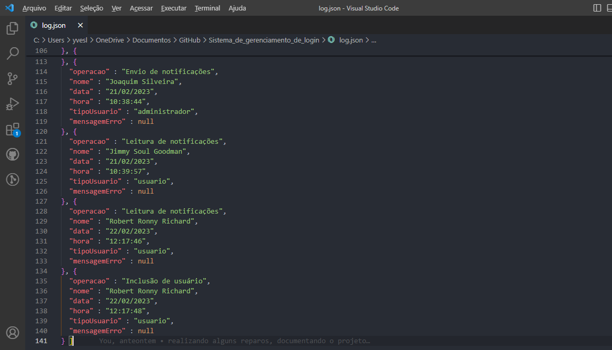

<h1 align="center"> Sistema de gestão de login </h1>

  

 Projeto desenvolvido com Java e sqlite.
 

  <a href="#-sobre-o-projeto">Sobre o projeto</a>&nbsp;&nbsp;&nbsp;|&nbsp;&nbsp;&nbsp; 
  <a href="#-layouts">Layouts</a>&nbsp;&nbsp;&nbsp;|&nbsp;&nbsp;&nbsp;
  <a href="#-requisitos-e-recomendações">Requisitos e recomendações</a>&nbsp;&nbsp;&nbsp;&nbsp;&nbsp;&nbsp;

</img>

# 💻 Sobre o projeto 

Sistemas de gestão de login é um projeto individual realizado para a matéria "projetos de software" e seu objetivo é criar um sistema de controle de login onde o administrador possa aceitar ou recusar novos usuários em conjunto com sistema de notificações, utilizando para isso, os padrões de projetos estudados em sala de aula. Os requisitos solicitados pelo professor estão em anexo: 

<a href="https://docs.google.com/document/d/1PVy3rGxElo1ZvVqJp5bf8mFNGYGrkdYmF1C5duBcrVQ/edit"> Requisitos para o trabalho</a>

# 📸 Layouts 

Tela de login

</img>

Tela principal do administrador

</img>
 

Tela de novas notificações endereçadas ao administrador

</img>
 

Registro de log. Tela de configuração e documento dos registros

</img>
 

</img>
 

  

# 📝 Requisitos e recomendações

PARA QUE O PROJETO FUNCIONE:  
1.1- 	Importe o projeto no netbeans, clique com o segundo botão do mouse no projeto e clique em "construir com dependências".  
1.2- 	Importe o projeto no eclipse, clique com o segundo botão do mouse no projeto e clique em "maven"->"update project".  
2-	  Execute o App.java do projeto.  

REQUISITOS:
- Java 11 ou superior.

OBS: 
- Para logar como administrador:  
Login: joaquim.silveira@user.com  
Senha: Joa$674 

- Para logar como um usuário comum já criado (caso não queira criar um):  
Login: goodman.saul@user.com  
Senha: Soul#14  

Pode ser que seja necessário digitar o login ao invés de copiar e colar.  
# ✒️ Autor

Yves Lima Silva

<a href="https://www.linkedin.com/in/yves-lima-b63b2515b/"> Linkedin </a>
